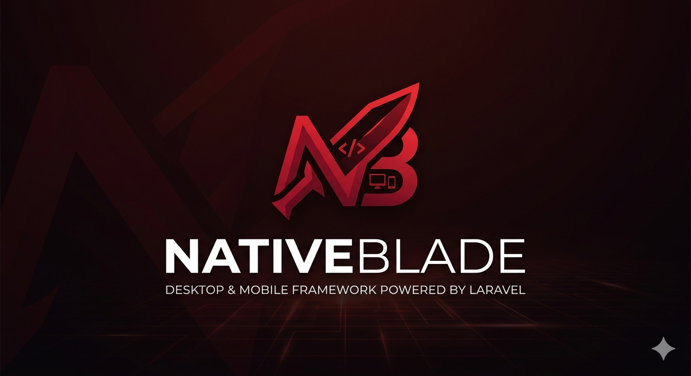

<p align="center">
  
</p>

<p align="center">
  <strong>Build desktop & mobile apps with Laravel + Livewire. No Electron. No React Native. Just PHP.</strong>
</p>

<p align="center">
  <a href="https://github.com/NativeBlade/NativeBlade/actions/workflows/tests.yml"></a>
  <a href="https://discord.gg/Vzpach5J2h"></a>
</p>

<p align="center">
  <a href="CONFIGURATION.md">Configuration</a> &bull;
  <a href="COMPONENTS.md">Components</a> &bull;
  <a href="DIRECTIVES.md">Directives &amp; Attributes</a> &bull;
  <a href="NAVIGATE.md">Navigate</a> &bull;
  <a href="PLUGINS.md">Plugins</a> &bull;
  <a href="PUSH.md">Push</a> &bull;
  <a href="MEDIA.md">Media</a> &bull;
  <a href="ANIMATIONS.md">Animations</a> &bull;
  <a href="LIFECYCLE.md">Lifecycle</a> &bull;
  <a href="DATABASE.md">Database</a> &bull;
  <a href="FILESYSTEM.md">Filesystem</a> &bull;
  <a href="BUILD.md">Build</a> &bull;
  <a href="SCHEDULER.md">Scheduler</a> &bull;
  <a href="UPDATES.md">Auto-Update</a> &bull;
  <a href="PUBLISH.md">Publish</a> &bull;
  <a href="MCP.md">MCP (AI agents)</a>
</p>

---

<p align="center">
  
</p>

---

NativeBlade lets Laravel developers build **desktop** and **mobile** apps using only **PHP and Blade**. Your entire Laravel + Livewire application runs inside a PHP WebAssembly runtime, wrapped in a [Tauri 2](https://v2.tauri.app) shell. No JavaScript frameworks. No API layers. Just the Laravel you already know.

## Features

- **Pure Laravel** — Routes, Livewire components, Blade templates, Eloquent (SQLite)
- **Tiny Bundle** — A full Laravel + Livewire app compresses to **~6 MB gzipped** (see [BUILD.md](BUILD.md#bundle-size--the-absurd-part))
- **Native Shell** — Top bar, bottom navigation, drawer, modal, tray — all outside the WebView
- **Native APIs** — Dialogs, notifications, camera, geolocation, haptics, biometric, NFC, barcode
- **Desktop** — Windows, macOS, Linux with native menus and system tray
- **Mobile** — Android & iOS with status bar, safe area, orientation control
- **Push Notifications** — Server-pushed notifications via FCM (Android) and APNS (iOS) that wake the app even when closed
- **Animations** — 90+ [Animate.css](https://animate.style/) animations + custom NativeBlade animations via `nb-animation` attribute
- **Offline-First** — SQLite persisted to IndexedDB, works without a server
- **Hot Reload** — Vite HMR for instant feedback during development, plus `--build` mode to preview the production bundle locally
- **Icons** — 3,024 [Phosphor Icons](https://phosphoricons.com/) (regular + fill) included
- **Custom Fonts** — Offline font loading via base64 embedding
- **Page Transitions** — Fade, slide, zoom, flip, bounce, blur — powered by Animate.css
- **AI-Ready** — Built-in [MCP server](MCP.md) so Claude Code, Cursor, and Windsurf can introspect your live project (declared plugins, facade methods, framework docs) instead of guessing

## Requirements

- PHP 8.3, 8.4, or 8.5 (with GD extension)
- Laravel 11, 12, or 13
- Livewire 3
- Node.js 20+
- Rust — [install here](https://www.rust-lang.org/tools/install)

## Quick Start

```bash
# 1. Create a new Laravel project
composer create-project laravel/laravel my-app
cd my-app

# 2. Install NativeBlade
composer require nativeblade/nativeblade
php artisan nativeblade:install

# 3. Build the frontend
npm run build

# 4. Launch the desktop app
php artisan nativeblade:dev
```

```
✓ src-tauri/          — Tauri project
✓ layouts/            — Blade layouts with shell support
✓ vite.wasm.config.js — Vite config for WASM bundling
✓ AppServiceProvider  — NativeBlade config
✓ Demo app            — Login, Trail, Lesson, Rank, Profile
```

> The first run compiles the Rust binary, which takes a few minutes. Subsequent runs are fast.

### Add Mobile

```bash
php artisan nativeblade:add android
php artisan nativeblade:dev --platform=android --host=192.168.0.10

php artisan nativeblade:add ios
php artisan nativeblade:dev --platform=ios --host=192.168.0.10
```

> **Mobile requires `--host=<your-local-ip>`** so the device/emulator can reach the Vite dev server running on your machine. Replace `192.168.0.10` with your computer's LAN IP (find it with `ipconfig` on Windows or `ifconfig` / `ip addr` on macOS/Linux). `localhost` won't work because the phone can't reach your machine through it.

### NativeBlade Portal — test on real devices without building

A companion app for iOS and Android that loads any NativeBlade dev bundle by URL or QR scan. Install once, then point it at your `nativeblade:dev` server to preview your app on a real device with no Xcode / Android Studio build needed.

[](https://apps.apple.com/us/app/nativeblade/id6765935943)
[](https://play.google.com/store/apps/details?id=com.nativeblade.app)

```bash
php artisan nativeblade:dev --platform=portal --host=192.168.0.10
```

Open the Portal app on your phone, scan the QR shown in your terminal (or paste the URL), and your Laravel + Livewire app loads in seconds. Switch between projects by changing the URL — no rebuild required.

### Preview the Production Bundle

Test the exact bundle that will ship — without the Vite dev server and without running a full `nativeblade:build`:

```bash
php artisan nativeblade:dev --build
php artisan nativeblade:dev --platform=android --build
php artisan nativeblade:dev --platform=ios --build
```

Builds the frontend once, points Tauri at `dist-wasm/`, and launches the app. Ideal for validating the real production payload or iterating on Rust/native shell without HMR in the way. See [BUILD.md](BUILD.md#production-preview---build).

## UI Components

NativeBlade ships only the shell + runtime, not a styled component library. Pick a UI kit that fits the form factor:

| Form factor | Recommended kit | Install |
|-------------|-----------------|---------|
| **Mobile** (iOS + Android) | [`nativeblade/ui-mobile`](https://github.com/NativeBlade/ui-mobile) — Konsta-inspired Blade components with iOS and Material themes auto-detected per platform | `composer require nativeblade/ui-mobile` |
| **Desktop** (Windows, macOS, Linux) | [Flux UI](https://fluxui.dev) — official Livewire UI kit by Caleb Porzio. Free core + paid Pro | `composer require livewire/flux` |

Any Livewire-compatible Blade UI library works (Filament, mary-ui, TallStackUI, Wireui, etc.). The shell, router, and bridges are component-agnostic.

## How It Works

```
┌─────────────────────────────────────────────┐
│  Tauri Shell (native window)                │
│  ┌──────────────────────────────┐           │
│  │  Top Bar / Header            │  ← Shell  │
│  ├──────────────────────────────┤           │
│  │                              │           │
│  │   iframe (srcdoc)            │           │
│  │   ┌──────────────────────┐   │           │
│  │   │  Laravel + Livewire  │   │  ← Your  │
│  │   │  via PHP WebAssembly │   │    App    │
│  │   └──────────────────────┘   │           │
│  │                              │           │
│  ├──────────────────────────────┤           │
│  │  Bottom Navigation           │  ← Shell  │
│  └──────────────────────────────┘           │
└─────────────────────────────────────────────┘
```

1. **Boot** — PHP WebAssembly loads your Laravel app (8.3, 8.4, or 8.5)
2. **Migrate** — Pending migrations run automatically
3. **onBoot** — Your startup code runs (license check, data sync, API calls) while splash is visible
4. **Route** — Each navigation runs through Laravel's router inside WASM
5. **Render** — Blade/Livewire HTML is rendered in an iframe
6. **Intercept** — Fetch interceptor routes HTTP requests through WASM
7. **Bridge** — Native actions flow through `postMessage`
8. **Schedule** — Rust timers execute recurring tasks via Laravel Schedule
9. **Persist** — SQLite syncs to IndexedDB automatically

## Database

Migrations run automatically on boot — no `php artisan migrate` needed. Use standard Laravel migrations and Eloquent:

```bash
php artisan make:model Task -m
```

```php
// Migration runs automatically when the app opens
Schema::create('tasks', function (Blueprint $table) {
    $table->id();
    $table->string('title');
    $table->boolean('done')->default(false);
    $table->timestamps();
});
```

```php
// Eloquent works as usual
Task::create(['title' => 'Buy milk']);
$tasks = Task::where('done', false)->get();
$task->update(['done' => true]);
```

## onBoot Hook

Run code before the app becomes visible. Splash stays up until complete:

```php
NativeBladeConfig::onBoot(function () {
    $license = Http::get('https://api.myapp.com/license/check')->json();
    NativeBlade::setState('license', $license);
});
```

HTTP Bridge, Storage, Eloquent — everything works inside `onBoot`. See [LIFECYCLE.md](LIFECYCLE.md).

## Scheduler

Laravel Schedule powered by Rust native timers. Define in `routes/console.php`:

```php
use Illuminate\Support\Facades\Schedule;

Schedule::call(fn () => SyncService::run())->everyFiveMinutes()->name('sync');
Schedule::call(fn () => CacheService::cleanup())->daily()->name('cleanup');
```

All Laravel frequency methods work. Overdue tasks execute on next app open. See [LIFECYCLE.md](LIFECYCLE.md).

## State Management

```php
use NativeBlade\Facades\NativeBlade;

NativeBlade::setState('auth.user', ['name' => 'John']);
$user = NativeBlade::getState('auth.user');
NativeBlade::forget('auth.user');
NativeBlade::flush();
```

## Log

Write log entries from any PHP context (Livewire actions, schedules, routes, `mount()`) and see them in the Tauri devtools console in real time. Works even when PHP crashes mid-execution — the logs written before the crash are preserved.

```php
use NativeBlade\Facades\NativeBlade;

NativeBlade::log('App started');
NativeBlade::log('Retrying', ['attempt' => 3], 'warn');
NativeBlade::log('Payment failed', ['error' => $e->getMessage()], 'error');
NativeBlade::log('Query ran', ['ms' => 12], 'debug');
```

Each level maps to a `console.*` method and a color in the `[NB:<level>]` prefix:

| Level | Console method | Prefix color |
|---|---|---|
| `info` (default) | `console.log` | blue |
| `warn` | `console.warn` | orange |
| `error` | `console.error` | red |
| `debug` | `console.debug` | purple |

The context array is rendered as an expandable object in the browser devtools.

## Platform Detection

```php
NativeBlade::platform();   // 'windows', 'macos', 'linux', 'android', 'ios'
NativeBlade::isDesktop();
NativeBlade::isMobile();
NativeBlade::isAndroid();
NativeBlade::isIos();
```

## Navigation

```php
NativeBlade::navigate('/dashboard')->toResponse();
NativeBlade::navigate('/', replace: true)->toResponse();
```

```blade
<button wire:nb-navigate="/users">Users</button>
<button wire:nb-navigate.replace="/">Home</button>
```

## Authentication

```php
// Middleware
$user = NativeBlade::getState('auth.user');
if (!$user) {
    return NativeBlade::navigate('/login')->toResponse();
}

// Login
NativeBlade::setState('auth.user', ['name' => 'Admin', 'email' => $email]);
return NativeBlade::navigate('/', replace: true)->toResponse();

// Logout
NativeBlade::forget('auth.user');
NativeBlade::navigate('/login', replace: true)->toResponse();
```

## HTTP Bridge

Laravel's `Http` facade works transparently — WASM can't make network requests directly, so NativeBlade bridges them through JavaScript:

```php
$response = Http::get('https://api.github.com/users');

// Parallel requests
$responses = NativeBlade::pool(fn ($pool) => [
    $pool->get('https://api.com/users'),
    $pool->get('https://api.com/posts'),
]);
```

## Laravel Compatibility

NativeBlade is a **client-side runtime**, so anything inherently server-side (sending email, processing queues, running cron daemons) is intentionally not built in — your Laravel server handles those, and the client talks to it.

| Works natively | Via bridge | Via your Laravel server | Custom plugin / shell component |
|----------------|-----------|-------------------------|----------------------------------|
| Routing, Blade, Livewire | `Http` facade (REST/GraphQL) | Queues, jobs, dispatched tasks | WebSockets / Pusher / Reverb |
| Eloquent on SQLite (local) | MySQL / PostgreSQL / MariaDB (remote, via Rust) | Mail (SMTP, Mailgun, SES) | BLE, Bluetooth Classic |
| Middleware, Validation | Native Filesystem (Storage) | Redis, Memcached | Thermal printer (ESC/POS) |
| Collections, Carbon, Eloquent relations | Camera, Gallery, Video, Barcode, NFC | File Storage (S3, R2, GCS) | Payment terminals (TEF) |
| Service Container, Facades | Biometric, Push (FCM/APNS), Haptics | Heavy reports / aggregations | SAT / fiscal printers |
| Localization, Validation rules | Geolocation, Clipboard, Notifications | Auth providers (OAuth, SSO) | Anything else with `tauriInvoke` |
| Migrations (auto on boot) | Tauri/Rust commands, Upload streaming | | |
| Task Scheduling (Rust timers) | Custom plugins via `tauriInvoke` | | |

> **WebSockets specifically:** Livewire's `wire:poll` covers most "real-time" needs in business apps with zero infrastructure. For genuine real-time (chat with typing indicators, collaborative editing), build a shell component that lives outside the iframe, connects to your WS server, and dispatches Livewire events. See [PLUGINS.md → Composer plugin discovery](PLUGINS.md#composer-plugin-discovery).

## Documentation

| Doc | Description |
|-----|-------------|
| [CONFIGURATION.md](CONFIGURATION.md) | Desktop, Android, iOS configs, permissions, privacy manifest, transitions |
| [NAVIGATE.md](NAVIGATE.md) | SPA routing — `wire:nb-navigate` directive, `NativeBlade::navigate()`, transition and replace modifiers |
| [COMPONENTS.md](COMPONENTS.md) | Shell components, icons, images, skeleton, fonts, safe area, custom components |
| [DIRECTIVES.md](DIRECTIVES.md) | wire:nb-bridge, wire:nb-navigate, nb-feedback, native actions |
| [PLUGINS.md](PLUGINS.md) | Built-in Tauri 2 plugin bridges (dialogs, notifications, clipboard, geolocation, haptics, biometric, barcode, NFC, opener, OS info) |
| [PUSH.md](PUSH.md) | Server push notifications via FCM (Android) and APNS (iOS) |
| [MEDIA.md](MEDIA.md) | Native camera, gallery and video pickers with on-device resize |
| [ANIMATIONS.md](ANIMATIONS.md) | nb-animation, Animate.css, custom animations, haptic feedback |
| [DATABASE.md](DATABASE.md) | SQLite local, native MySQL/PostgreSQL/MariaDB via Rust bridge |
| [LIFECYCLE.md](LIFECYCLE.md) | Boot sequence, onBoot hook, clock sync, migrations |
| [SCHEDULER.md](SCHEDULER.md) | Task scheduling with Rust native timers |
| [FILESYSTEM.md](FILESYSTEM.md) | Native filesystem, Storage driver, camera integration |
| [BUILD.md](BUILD.md) | Build command, output, CLI commands, icon generation |
| [UPDATES.md](UPDATES.md) | Auto-update for desktop and mobile |
| [PUBLISH.md](PUBLISH.md) | Publishing to stores |
| [MCP.md](MCP.md) | Built-in MCP server so Claude Code / Cursor / Windsurf can introspect your live project (declared plugins, facade methods, framework docs) |

## How NativeBlade Differs

| | NativeBlade | Electron | React Native | Flutter |
|---|---|---|---|---|
| **Language** | PHP + Blade | JavaScript | JavaScript | Dart |
| **Backend** | Built-in (Laravel) | Separate | Separate | Separate |
| **Binary Size** | ~15 MB | ~150 MB | ~30 MB | ~20 MB |
| **App Bundle** | ~6 MB gzip (full Laravel) | — | — | — |
| **Learning Curve** | None (if you know Laravel) | Medium | High | High |
| **Native UI** | Shell + WebView | WebView only | Native | Custom rendering |
| **Offline** | Yes (WASM + IndexedDB) | Manual | Manual | Manual |

## Testing

NativeBlade ships with a three-layer test suite that runs on every push to `main` via [GitHub Actions](https://github.com/NativeBlade/NativeBlade/actions/workflows/tests.yml).

**PHP** — PHPUnit against Laravel 11/12/13 on PHP 8.3/8.4/8.5 via Testbench:

```bash
composer test
composer test:coverage          # text summary (needs pcov or Xdebug)
composer test:coverage-html     # full HTML report in build/coverage/
```

**JavaScript** — `node:test` suite covering the runtime bridges (db/http/fs), action handlers and ctx helpers. No browser needed:

```bash
npm test
```

**Rust** — `cargo test` suite covering the Tauri command handlers (config, fileops, database row serialization, scheduler). sqlx integration tests use in-memory SQLite:

```bash
cd rust
cargo test --lib
```

**Run everything locally:**

```bash
composer test && npm test && (cd rust && cargo test --lib)
```

## Contributing

See [CONTRIBUTING.md](CONTRIBUTING.md) for guidelines.

## License

MIT

---

<p align="center">
  Built with Laravel, Livewire, Tauri, and PHP WebAssembly.<br>
  <a href="https://www.linkedin.com/in/jefferson-silva-66bba7aa/">Jefferson T.S</a>
</p>
